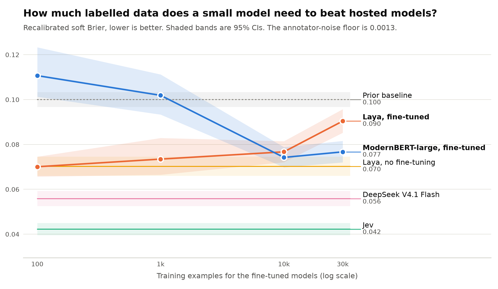
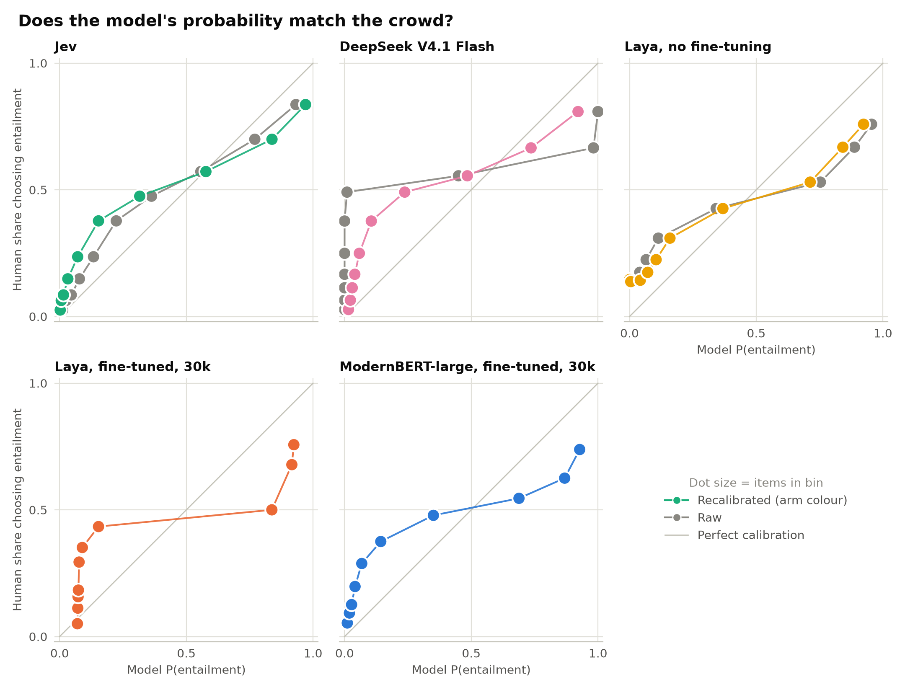

# Crowdcal

Does 70% mean 70% of people agree? Crowdcal is a pre-registered calibration benchmark for typed decision models. It scores each model's P(entailment) against the full distribution of human labels, meaning the share of ChaosNLI's 100 annotators who chose entailment. It also measures how much labelled data a fine-tuned small model needs to beat hosted models, and what each option costs per 1,000 decisions.

**Results page:** [amansinghnp.github.io/crowdcal](https://amansinghnp.github.io/crowdcal/) · **Design:** [SPEC.md](SPEC.md), [PREREG.md](PREREG.md)

<picture>
  <source media="(prefers-color-scheme: dark)" srcset="docs/headline-dark.png">
  
</picture>

## Findings (v1.0)

The test set is 3,113 ChaosNLI items (SNLI and MNLI-matched), each labelled by 100 annotators. The metric is soft Brier, (p − q)², where q is the human share choosing entailment. Lower is better. The best score achievable given annotator noise is 0.0013. Everything in this section is pre-registered unless it's marked exploratory.

1. **The fine-tuned small model never beat the best hosted model, so the pre-registered hypothesis H1 is refuted.**
   - Jev, TypeSafe's hosted decision model, has the lowest soft Brier of any arm: **0.0325** raw and 0.0422 recalibrated.
   - Fine-tuned Laya at 30k examples scores 0.0904 recalibrated, which is **0.048 worse** than Jev (95% CI [0.043, 0.053]).
   - There is no crossover at any training size.
2. **More labelled data made the fine-tuned models worse at matching human disagreement.**
   - Fine-tuned Laya scores 0.070 at 100 examples, 0.074 at 1k, 0.077 at 10k and 0.090 at 30k.
   - MNLI's single-label training teaches the models to be confident. At 30k examples, Laya gives a probability below 0.05 or above 0.95 on 96% of ordinary MNLI dev items. That scores well on typical items (0.039) and badly on ChaosNLI's ambiguous ones.
3. **Laya's pipeline beats plain fine-tuning at small data, and the advantage flips at large data.** These comparisons are Holm-corrected.
   - Laya is better than the plain ModernBERT-large classifier at 100 examples (−0.041) and at 1k (−0.028).
   - The two tie at 10k (p = 0.31).
   - Laya is worse at 30k (+0.014).
4. **Recalibrating on ordinary data hurt the best-calibrated model.**
   - Temperature scaling fitted on MNLI dev sharpens Jev (T = 0.72), and that makes it worse on the ambiguous test items.
   - The same step fixes DeepSeek's near-binary outputs (0.103 → 0.056).
   - Calibration fitted on typical items doesn't transfer to disagreement.
5. **Q1, calibration against the crowd:** Jev's raw probabilities follow the human share most closely (ECE 0.071). When it says about 0.77, about 70% of annotators chose entailment. DeepSeek V4.1 Flash, with reasoning off, puts nearly all its mass at 0 or 1.

<picture>
  <source media="(prefers-color-scheme: dark)" srcset="docs/reliability-dark.png">
  
</picture>

6. **Q3, cost per 1,000 decisions:**
   - Jev: $0.013
   - DeepSeek: $0.022
   - Local models on a T4 at $0.35/hr: about $0.003–0.004
   - Fine-tuning: $0.01–0.87 per run in GPU time
   - The full API run cost $2.31.

**Limitations:**
- The fine-tuned arms train on single hard labels. The test set is deliberately ambiguous.
- Fine-tuned Laya uses the upstream recipe unchanged, which gives it only about 8 optimizer steps at 100 examples (PREREG A3).
- The 10k and 30k points have one training seed each.
- The results cover one task (NLI) and one domain. The civil_comments replication is planned for v1.1.

## Reproduce

Every number on the results page is rebuilt from the frozen raw model responses in `data/raw/`. There are 453,642 rows, stored as gzip and verified against `SHA256SUMS`. No API calls are needed.

```
uv sync
uv run crowdcal report     # rebuilds docs/ from data/raw + data/splits
uv run pytest
uv run crowdcal demo       # synthetic end-to-end run -> build/demo/site/
```

The splits are built from public ChaosNLI and MultiNLI files with `uv run crowdcal splits`. `data/splits/` stores item IDs only.

## How it was run

1. **Pre-registration:** `prereg-v1` was tagged before any model call. Amendments A1–A3, all made before any test output was examined, are in [PREREG.md](PREREG.md).
2. **Hosted arms:** Jev and DeepSeek were called via OpenRouter, and base Laya ran locally. Commands: `crowdcal run --arm <arm> --split calib|test`.
3. **Fine-tuned arms:** trained and scored on Kaggle's 2×T4 GPUs with [`notebooks/`](notebooks/). Checkpoints were selected on dev only.
4. **Analysis:** `crowdcal freeze` and then `crowdcal report`. The frozen data was committed before the report was generated.

`crowdcal run` refuses every real model call unless the `prereg-v1` tag exists.

Code is MIT-licensed. The data in `data/` and `docs/` is CC BY 4.0.
